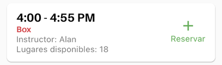
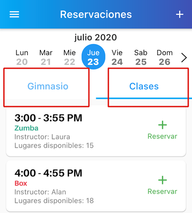
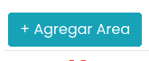
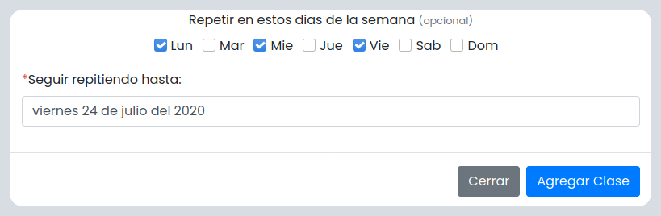
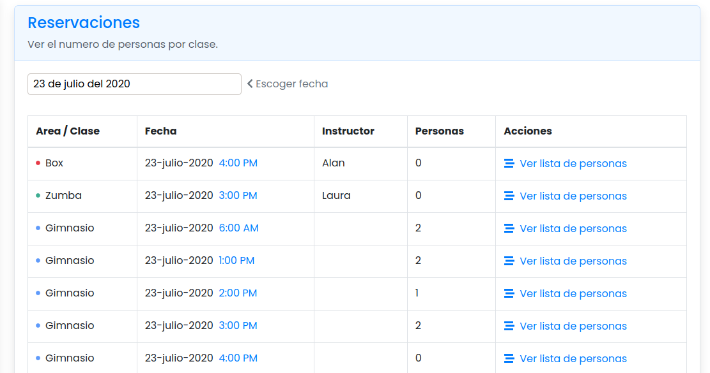
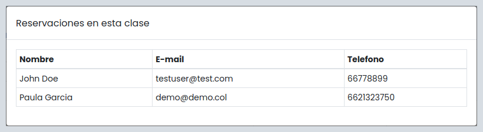

# Reservaciones 

## Bloque Horario
Nos referimos por **bloque horario** a los horarios que tus clientes pueden
reservar desde la app. Consisten principalmente en:
  - Nombre (Ejemplo: Area de Pesas, Spinning, Yoga, etc...)
  - Fecha de Inicio
  - Duración

**Ejemplo de como se ve un bloque horario desde la app de tus clientes:**  
  
Puedes crear cuantos bloques quieras desde la plataforma y estos aparecen inmediatamente
en la aplicación de tus clientes.

## ¿Clase o Gimnasio?
En la barra izquierda de la plataforma hay 2 secciones importantes:
la sección de **Clases** y debajo la sección de **Gimnasio**

Puedes utilizar cualquiera de estas dos secciones para crear bloques horarios, la única
diferencia es la sección donde aparecerán en la app de tus usuarios.

***Dependiendo en que sección crees el bloque, aparecerá en la app de tus usuarios:***  

## Creando un Bloque para Reservaciones
Teniendo lo anterior en cuenta vamos a crear de ejemplo un bloque horario que tus clientes
pueden reservar.

1. Dentro de la plataforma de SafeGymAdmin dirígete a la sección que gustes, ya sea Clases o Gimnasio.
2. Arriba del calendario en la parte izquierda haz click en el boton de *Agregar Área* o *Agregar Clase*.

       
    
    Aparecerá el formulario para crear un nuevo bloque horario.
3. Llenar el formulario
  - Agrega el nombre del *área* o *clase* como deseas que aparezca en la app de tus usuarios.
    > Nota: Si aparece un texto diciendo: *Crear nueva clase*, solo presiona la tecla *Enter*.
  - Pon el limite máximo de usuarios que quieres que reserven.
  - Escoge la hora en que comenzara el bloque horario.
  - Ingresa la duración del bloque en **minutos**.
  - Agrega la fecha en que desees que reserven este bloque tus usuarios.
  
4. En este momento ya puedes crear el bloque y tus usuarios podrán reservarlo. Pero la plataforma de 
SafeGym tiene la poderosa característica de crear bloques **recurrentes** que 
probablemente quieres usar (ver siguiente sección).

## Bloques Recurrentes
Los bloques recurrentes son aquellos que se repiten a la misma hora cada semana. En la sección de abajo del
formulario veras las siguientes opciones:

> **Nota:** Tienes que seleccionar por lo menos un día de la semana para que aparezca la opción de: *Seguir repitiendo hasta*

Simplemente escoge los días de la semana en que quieres que este bloque se repita.  
 Asegurate de escoger bien la fecha final
que aparece como: ***Seguir repitiendo hasta*** para que todo funcione como esperas y **listo!**

## ¿Puedo cancelar un bloque horario?
La única forma de cancelar un bloque horario es eliminándolo. Si usuarios de la app tienen reservaciones pendientes 
en ese bloque horario, se les cancelara automáticamente. 

## Tabla de Reservaciones
Puedes accederla desde la barra izquierda, en la seccion *Reservaciones*.
> La tabla de reservaciones te ayuda a visualizar los bloques horarios activos del día.

## Lista de Personas
Al final de cada fila de la tabla de Reservaciones hay una celda con el texto *Ver lista de personas*.
Al hacer click en este texto se abrira una lista de las personas con reservacion en ese
bloque.

